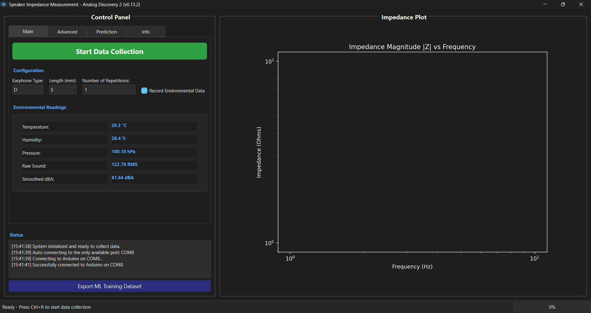
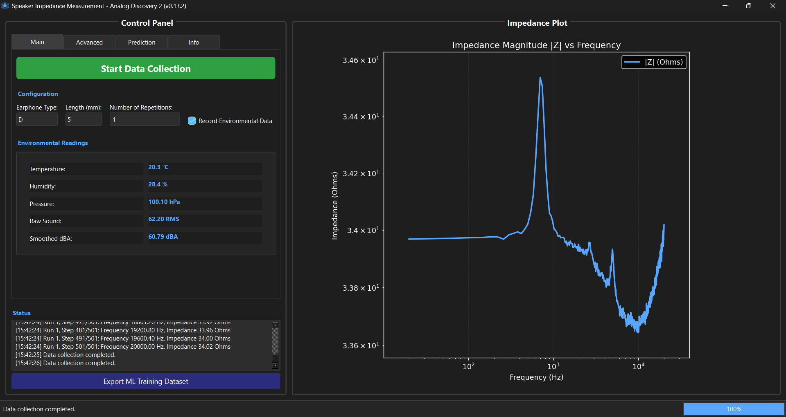
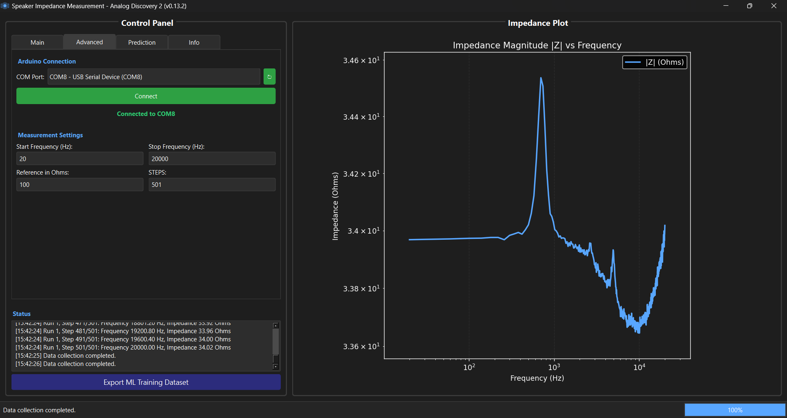
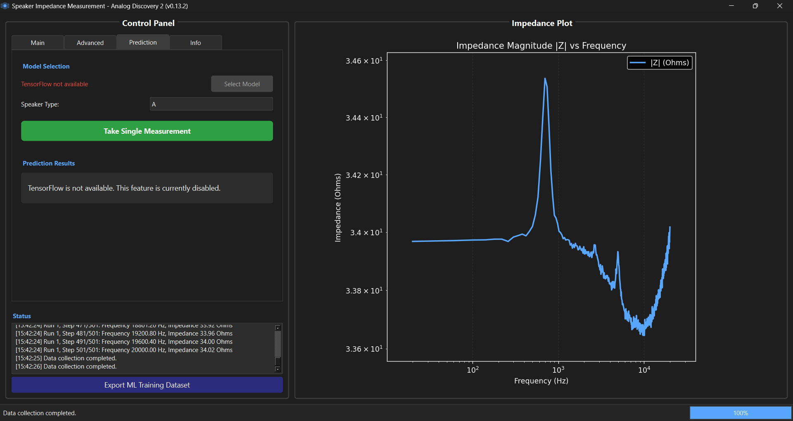

# Speaker Impedance

[](CHANGELOG.md/#latest)
[](https://www.python.org/downloads/release/python-31011/)
[](https://pypi.org/project/PyQt6/)
[](https://digilent.com/reference/test-and-measurement/guides/waveforms-sdk-getting-started?srsltid=AfmBOorRtu33lsD6IVZflrbMJIFuTLurrbm7XozjjqH9yrPqBuhSF0tu)
[](https://www.mathworks.com/products/matlab.html)

## Overview

This repository contains the code and data for the speaker impedance research project. The following are the main components of the project:

- **Analog Discovery** - The device of choice for this project is the Analog Discovery 2. This contains Automated impedance measurement application developed using PyQt6 with the WaveForms SDK.
  - `Speaker_Impedance_Measurer.py`: The latest GUI for automated impedance data collection.
    - The main application also includes a prediction tab for predicting speaker tube length from impedance measurement using a trained model.
  - Older versions of the GUI are located in the `Older` folder. The older GUI was developed using tkinter, with an identical application developed using PyQt6.

- **Tympan** - Working with the Tympan library, this module is developed to allow the impedance measurement process to be done on a Tympan with the audio hat.

- **Arduino Code** - Environmental monitoring system that reads temperature, and humiditydata from the testing enclosure. The data is displayed in real-time in the GUIs and recorded in the measurement CSV files.

- **MATLAB Code** - MATLAB code for plotting the collected impedance data for visualization.

## Getting Started

1. Clone this repository:

   ```bash
   git clone https://github.com/ckyb63/speaker_impedance.git
   cd speaker_impedance
   ```

2. Install required dependencies, using the requirements.txt file located in the docs folder:

   ```bash
   pip install -r requirements.txt
   ```

3. Install the [WaveForms SDK](https://digilent.com/reference/software/waveforms/waveforms-sdk/start) from Digilent's website

4. Connect your hardware:
   - Connect the Analog Discovery 2 device via USB
   - (Optional) Connect an Arduino Nano 33 Sense loaded with `Nano_33_Ta_Hu_Pa.ino` to monitor environmental conditions (temperature, humidity, pressure, and sound level)
     - For the project, the .ino file was uploaded using the Arduino IDE, make sure select the correct board and port as well as having the necessary libraries installed.

5. Run the GUI application to make measurements:

   ```bash
   python Analog Discovery/Speaker_Impedance_Measurer.py
   ```

## Data Collection Workflow

1. Set up the testing environment/enclosure.
2. Configure measurement settings in application.
    - Select the speaker type and length.
3. Connect the speaker to the Analog Discovery
4. If Arduino is connected, the environmental data will be displayed in the GUI, and checkbox can be selected to record the data in the CSV file.  
5. Start measurement
6. Decide if a combined CSV file is needed, if so click on the "Export ML Dataset" button.
7. Review collected data

## Troubleshooting

- If the Analog Discovery 2 is not detected, ensure WaveForms SDK is properly installed and the device is connected via USB by checking the device manager.
- For Arduino communication issues, verify the correct COM port is selected in the GUI.

## Updates

For more detailed updates, see the [changelog](CHANGELOG.md) for recent updates and changes.

## Screenshots

<details>
  <summary>Main GUI Window - Main Tab on Application Open</summary>

  
</details>

<details>
  <summary>Main GUI Window - Main Tab on Data Collection Finish</summary>

  
</details>

<details>
  <summary>Main GUI Window - Advanced Settings Tab</summary>

  
</details>

<details>
  <summary>Main GUI Window - Prediction Tab</summary>

  
</details>

## Contributors

Max Chen
